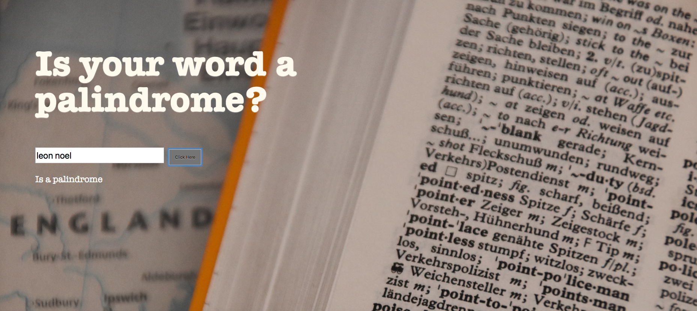

# Palindrome Answer
This is a simple app that returns wether the word or words a user enters is a palindrome or not.

## How It's Made:

**Tech used:** HTML, CSS, JavaScript
The logic behind this project uses an api built in the backend on node that will turn any string entered in by the user into an array that can be split, reversed, and joined with array methods. This would allow the word to be checked if it's spelt the same backwards as it forwards making it a palindrome.

## Lessons Learned:

Some important takeaways from working on this series was learning more about Node.js and putting your files completely server side. I learned about necessary core modules for this project such as 'http' and 'fs'. I learned how to create a simple API by making an API object. I also learned how to use the command line for node to locally host the project on the server.
